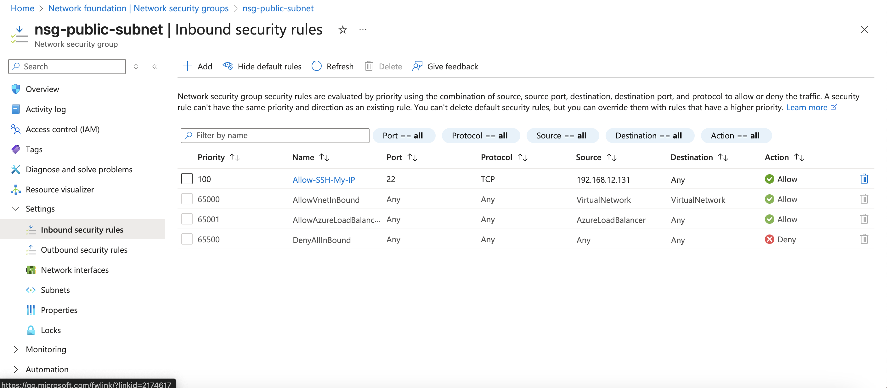
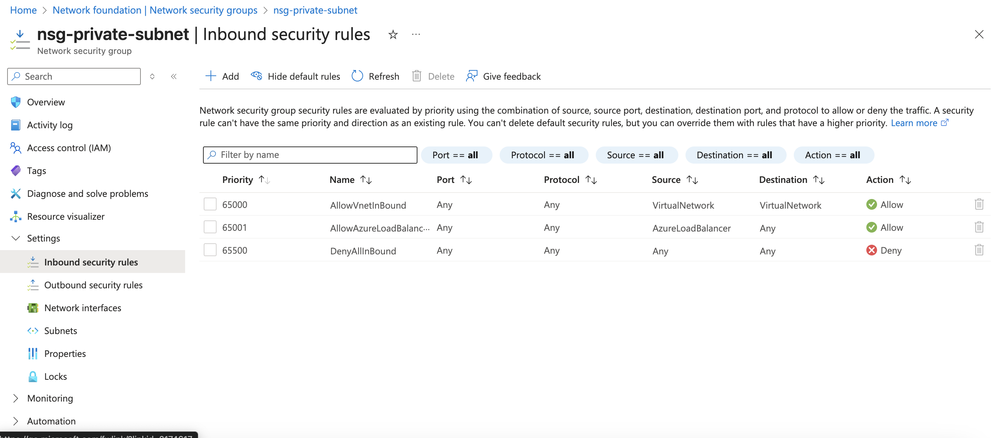
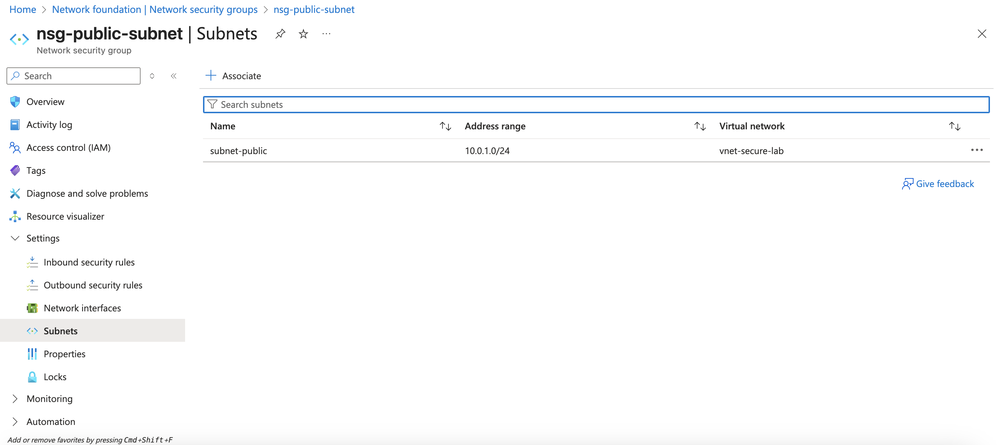
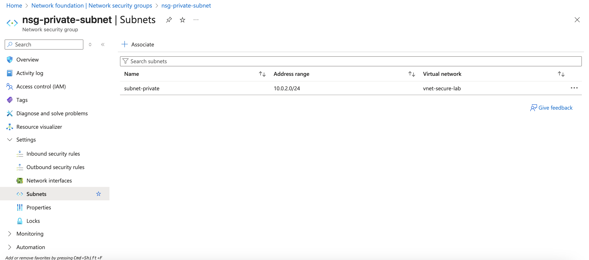

# Azure Secure Network Lab

A hands-on lab demonstrating secure network segmentation in Microsoft Azure using Virtual Networks, subnets, and Network Security Groups (NSGs). This project reflects real-world principles for isolating resources, restricting access, and reducing the attack surface in cloud environments.

---

## Objective

Design and implement a segmented Azure network architecture that enforces least-privilege access at the network layer — restricting inbound traffic to only what is explicitly required and denying everything else by default.

---

## Architecture Overview

| Component | Configuration |
|---|---|
| Azure Virtual Network | 10.0.0.0/16 |
| Public Subnet | 10.0.1.0/24 |
| Private Subnet | 10.0.2.0/24 |
| Security Controls | Subnet-level NSGs |

The public subnet is exposed to limited inbound traffic (SSH from a trusted IP only). The private subnet is fully isolated with a default-deny inbound policy — simulating how internal resources, such as databases or backend services, would be protected in a production environment.

---

## Security Controls Implemented

- **Public Subnet NSG:** Inbound SSH (port 22) restricted to a single trusted IP address. All other inbound traffic is denied.
- **Private Subnet NSG:** Default deny-all inbound rule applied. No unsolicited inbound connections permitted.
- **Network Segmentation:** Public and private subnets are isolated to prevent lateral movement between tiers.
- **NSG-to-Subnet Association:** Security rules enforced at the subnet level rather than per-VM, ensuring consistent coverage.

---

## Validation & Testing

- Reviewed and confirmed inbound rules on the public NSG were scoped to the correct trusted IP
- Verified the private subnet NSG had no permissive inbound rules — only default deny
- Confirmed NSG associations were correctly applied to both subnets
- Reviewed rule priority ordering to ensure deny rules were not overridden

---

## Tools & Technologies

`Microsoft Azure` `Virtual Networks (VNet)` `Network Security Groups (NSG)` `Subnets` `Azure Portal` `Cloud Network Security` `Least Privilege` `Network Segmentation`

---

## Screenshots

### Public Subnet NSG — Restricted Inbound Rules

### Private Subnet NSG — Default Deny Policy

### Public NSG to Subnet Association

### Private NSG to Subnet Association

---

## 💡 Key Takeaways

- Gained practical experience designing a multi-tier Azure network architecture from scratch
- Understood how NSG rule priority works and how misconfigured rules can create unintended access
- Applied the principle of least privilege at the network layer — a core concept in both cloud security and zero trust architecture
- Reinforced how network segmentation limits the blast radius of a potential compromise by preventing lateral movement between subnets

---

## Related Projects

- [Cloud Security Labs](https://github.com/Sebasttianp/cloud-security-labs) — Azure, Entra ID, IAM, and MFA
- [Cloud Security Anomaly Detection](https://github.com/Sebasttianp/cloud-security-anomaly-detection) — ML-based detection for cloud audit logs
